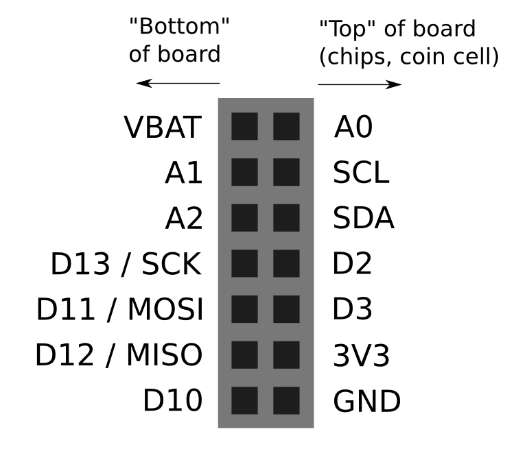
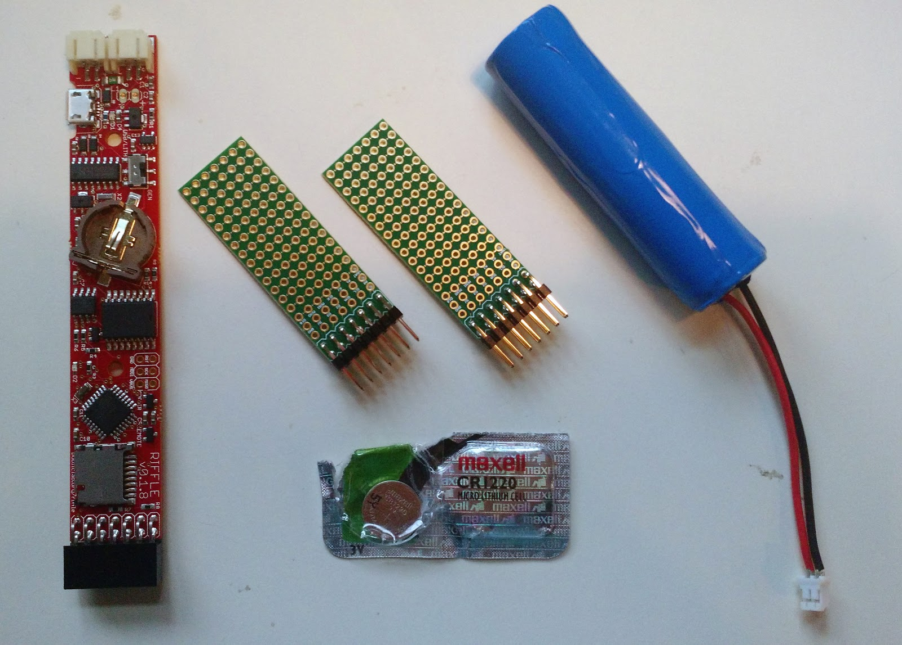
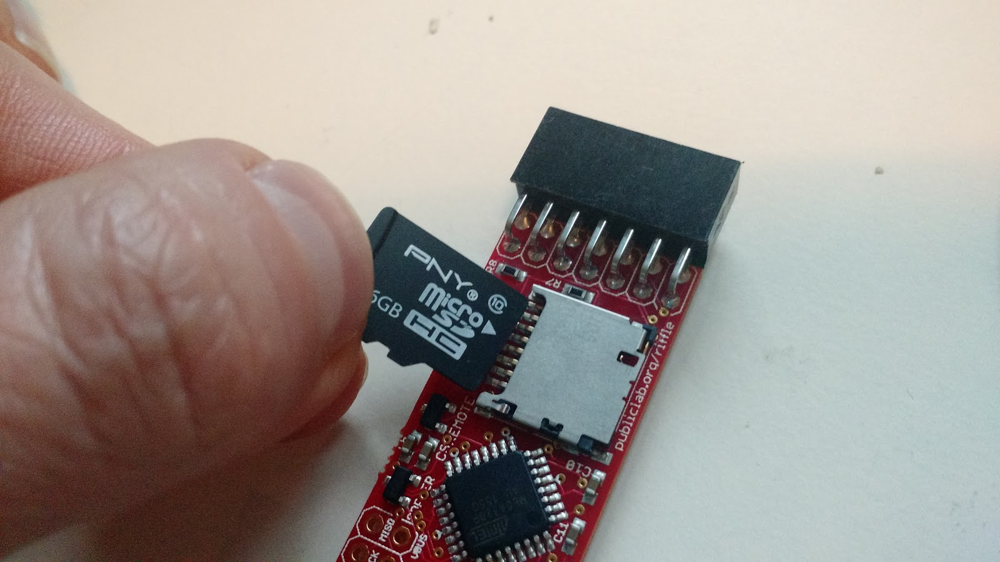
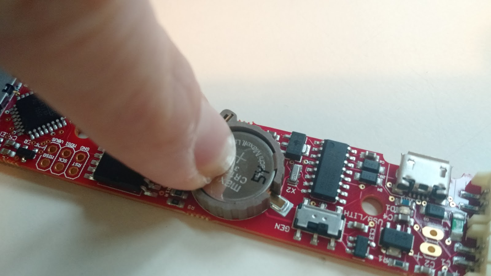
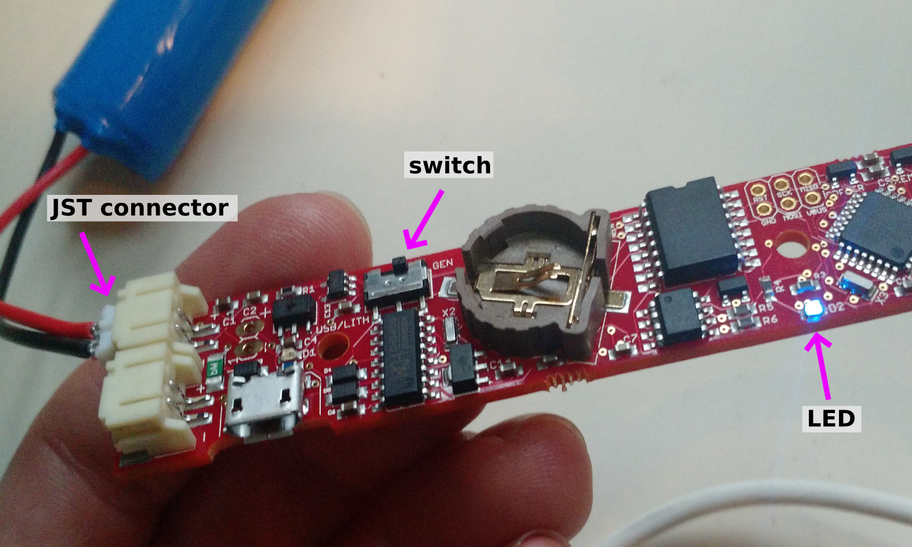
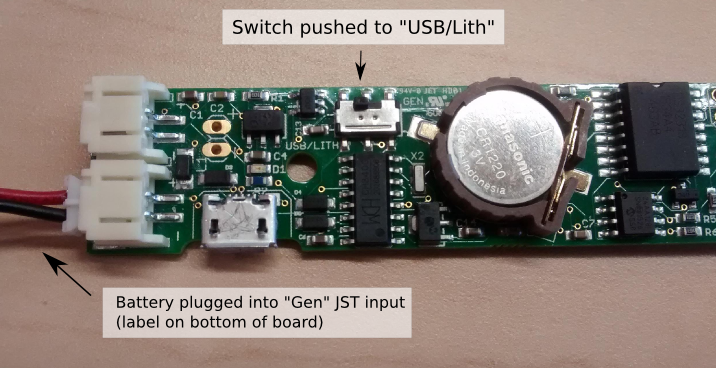

#Welcome!

This is a set of code and instructions for getting started with the Riffle_328 water monitor, version 0.1.8. 

- **QUICK START**.   If you already have experience using Arduino-compatible boards, you should probably just jump to the [Quick Start](https://github.com/dwblair/Riffle-Getting-Started#quick-start) section below to get up and running quickly. In general, the Riffle behaves like an Arduino UNO in the Arduino IDE (you should select "Arduino UNO" as the "Board" in the IDE), but you'll need to install a **special driver** (see [Software prep](test), below) in order to program the device over USB if you're using Mac or Windows.  

- **STEP-BY-STEP**.  If you would prefer more detailed instructions for setting up your Riffle, please check out the [Step-by-Step Instructions](./step-by-step.markdown).

- **EXAMPLES**. If you'd like to try out some example Riffle sensor applications (temperature, pressure, etc) in the [wiki](https://github.com/dwblair/Riffle-Getting-Started/wiki) of this repository (add your own!).

- **DESIGN PHILOSOPHY**.  A brief description of the motivation behind the design of the Riffle can be found [here](https://github.com/OpenWaterProject/riffle/blob/master/design_philosophy.md).  

# How you can contribute

Some useful guidelines about the best way to contribute to the project (or to fork it) can be found [here](contributing.md)

# About this project
The Riffle_328 project has been supported through [Public Lab](www.publiclab.org)'s Open Water Initiative, and is licensed under [CERN OHL 1.2](LiCENSE.md).

# Quick Overview

**Hardware notes**.  The [Riffle_328 hardware github repository](https://github.com/OpenWaterProject/riffle) contains the design files and Bill of Materials for the board.  The Riffle_328 is directly compatible with the Arduino IDE (it can be programmed as an "Arduino UNO" board).  The Riffle_328 ver 0.1.8 has the following features:

- Programmed as an "UNO" in the Arduino IDE
- Uses an Atmel 328p chip, running at 16 MHz and 3.3V.
- On-board microSD card
- On-board Serial-USB conversion using the CH340 chip.
- Battery measurement circuit
- High-precision, temperature-compensated RTC, the DS3221, with a CR1220 backup battery to maintain the time.
- Two power inputs, 3.5 - 6V.  -- one allows for Lithium-Ion charging when the Riffle is plugged into USB, the other is for extended, low-power operation. 
- It has additional on-board EEPROM memory, accessible via the I2C bus.
- It has MOSFET switches that can power down the microSD card, the external sensor power, and the battery measurement circuitry. 
- Analog pins, Digital pins, Power, Ground, Battery voltage, and I2C and SPI buses are broken out on a 2x7 header at the end of the board, as follows:

**Versions of the Riffle**. [Ben Gamari](https://github.com/bgamari)'s original [Riffle design](https://github.com/bgamari/riffle) is based on an ARM Cortex-M4 chip, the Kinetis K20.  The K20 is a more powerful chip than the Atmel 328, but the K20 version of the Riffle doesn't currently have firmware compatible with the Arduino IDE.  The Riffle_328 design covered in this repository is intended to be as directly compatible with the Arduino IDE as possible.

**Finding more resources**. The Riffle has been developed through many contributions by members of the [Public Lab](http://publiclab.org) community.  For more information, see:

- The main [Public Lab Riffle wiki](https://publiclab.org/wiki/riffle);
- All [posts and research notes](https://publiclab.org/search/riffle) related to the Riffle on Public Lab;
- The [Public Lab Water Quality Mailing list](https://groups.google.com/forum/#!forum/plots-waterquality).

# Quick Start

## Hardware prep

- For basic datalogging, ou'll need a Riffle board, a 3-6 volt battery (3.7 V Lithium Ion battery shown), and CR1220 coin cell battery.  Protoboards (shown) are optional. 

- Insert a microSD card and a CR1220 coin cell into the appropriate slots on the Riffle.

- The Riffle 328 ver 0.1.8 has two JST connectors for power inputs, a switch to choose between the two power inputs, and an indicator LED in the middle of the board (connected to pin 9):

- Insert a lithium ion battery into the 'Lith/USB' JST connector (JST connector labels are on the back side of the board).

- Make sure that the switch on the Riffle is switched to the side labeled 'Lith/USB' (label is next to switch).

- When you're done, your setup should look like this:

## Software prep

- Make sure that the Arduino IDE (version 1.6.10 or higher) is installed.  If it
 isn't, get it [here](https://www.arduino.cc/en/Main/Software).

- **Installing the USB-Serial Driver**. On Mac or Windows, the Riffle requires a special driver in order to be programmed via the Arduino IDE, due to the onbaord CH340 USB-Serial chip.  For Windows, you can use the driver [here]( http://raysfiles.com/drivers/ch341ser.exe).  For Mac, follow instructions [here]( http://www.instructables.com/id/Arduino-Nano-CH340/). Linux systems should generally not require additional drivers.

- Copy all of the folders in 'arduino_libraries' into the 'libraries' folder inside the 'sketchbook' folder associated with the Arduino IDE install.  These libraries are necessary for running the 'temp_logger.ino' and 'set_rtc.ino' sketches in this repo.  

## Logging values to the microSD card

- Using the Arduino IDE, compile the 'temp_logger.ino' code from the "example_sketches" folder in this repo, and load it onto the Riffle board, using 'Arduino UNO' as the 'Board' version in the Arduino IDE.

- The Riffle should start logging temperature values to the microSD card. These temperature values come from the on-board RTC, and so may be affected by the temeprature of the board (which might slightly higher than ambient temperature, due to the operation of its circuitry). 

- Note: the RTC will have its time set automatically to the system clock when it is programmed via the Arduino IDE.

## Extending the battery lifetime

- Set DEBUG = 0 in temp_logger.ino. This will reduce power by turning off the Serial interface.  It will also mean that the RTC is not set by the System clock.

- Use the 'GEN' JST connector on the Riffle board.  This power input doesn't have a protective diode, thus avoiding a diode-associated voltage drop, and can power the Riffle down to lower battery voltages.

- Test out different microSD cards;  some of them 'sleep' at lower power settings than others.

# License

This hardware is licensed under the [CERN Open Hardware License Version 1.2](http://www.ohwr.org/attachments/2388/cern_ohl_v_1_2.txt).

